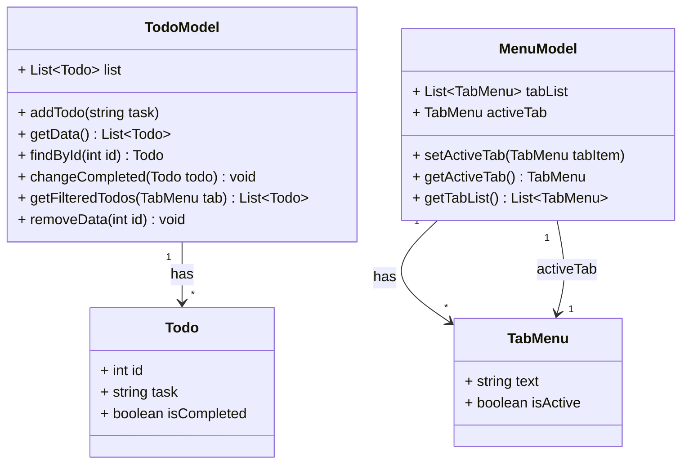

# ToDo GUI

ToDo Applications created using various GUI tools.


## Language

- Dart
  - [Flutter](https://github.com/webcyou-org/todo-gui/tree/main/Dart/Flutter/todo)
  - Rikulo UI

- Python
  - [Flet](https://github.com/webcyou-org/todo-gui/tree/main/Python/Flet)
  - [tkinter](https://github.com/webcyou-org/todo-gui/tree/main/Python/tkinter)
  - [Kivy](https://github.com/webcyou-org/todo-gui/tree/main/Python/Kivy)
  - [Remi](https://github.com/webcyou-org/todo-gui/tree/main/Python/remi)
  - [Reflex](https://github.com/webcyou-org/todo-gui/tree/main/Python/reflex/todo)
  - [PyQt](https://github.com/webcyou-org/todo-gui/tree/main/Python/pyqt)
  - [TkEasyGUI](https://github.com/webcyou-org/todo-gui/tree/main/Python/TkEasyGUI)
  - [Toga](https://github.com/webcyou-org/todo-gui/tree/main/Python/Toga)
  - [PyForms](https://github.com/webcyou-org/todo-gui/tree/main/Python/PyForms)
  - [PyGTK](https://github.com/webcyou-org/todo-gui/tree/main/Python/PyGTK)
  - [wxPython](https://github.com/webcyou-org/todo-gui/tree/main/Python/wxPython)
  - Azul

- C++
  - [QT](https://github.com/webcyou-org/todo-gui/tree/main/C%2B%2B/QT)
  - [wxWidgets](https://github.com/webcyou-org/todo-gui/tree/main/C%2B%2B/wxWidgets)
  - GTK
  - [GTKmm](https://github.com/webcyou-org/todo-gui/tree/main/C%2B%2B/GTKmm)
  - [FLTK (Fast Light Toolkit)](https://github.com/webcyou-org/todo-gui/tree/main/C%2B%2B/FLTK)
  - [NanoGUI](https://github.com/webcyou-org/todo-gui/tree/main/C%2B%2B/NanoGUI)
  - Ultimate++ (U++)
  - CEGUI (Crazy Eddie's GUI)
  - Cinder
  - ImGui (Immediate Mode GUI)
  - Azul

- JavaScript
  - [Electron](https://github.com/webcyou-org/todo-gui/tree/main/JavaScript/Electron)
  - [Tauri](https://github.com/webcyou-org/todo-gui/tree/main/JavaScript/tauri/vite/todo-gui)
  - [Neutralino.js](https://github.com/webcyou-org/todo-gui/tree/main/JavaScript/Neutralinojs/todo/)
  - [NW.js](https://github.com/webcyou-org/todo-gui/tree/main/JavaScript/NWjs/)
  - [React Native](https://github.com/webcyou-org/todo-gui/tree/main/JavaScript/ReactNative/todo)
  - [Wails](https://github.com/webcyou-org/todo-gui/tree/main/Go/Wails/todo)
  - [Lorca](https://github.com/webcyou-org/todo-gui/tree/main/Go/Lorca)
  - [Remi](https://github.com/webcyou-org/todo-gui/tree/main/Python/remi)
  - [Reflex](https://github.com/webcyou-org/todo-gui/tree/main/Python/reflex/todo)
  - [Dioxus](https://github.com/webcyou-org/todo-gui/tree/main/Rust/Dioxus/todo/)
  - [Proton Native](https://github.com/webcyou-org/todo-gui/tree/main/JavaScript/ProtonNative/todo)
  - [DeskGap](https://github.com/webcyou-org/todo-gui/tree/main/JavaScript/DeskGap/todo)
  - [Carlo](https://github.com/webcyou-org/todo-gui/tree/main/JavaScript/Carlo/todo)
  - Sciter
  - Ultralight
  
- Go
  - [Fyne](https://github.com/webcyou-org/todo-gui/tree/main/Go/Fyne)
  - [Lorca](https://github.com/webcyou-org/todo-gui/tree/main/Go/Lorca)
  - [Wails](https://github.com/webcyou-org/todo-gui/tree/main/Go/Wails/todo)
  - [Gio](https://github.com/webcyou-org/todo-gui/tree/main/Go/Gio)
  - Walk
  - [Go-GTK](https://github.com/webcyou-org/todo-gui/tree/main/Go/Go-GTK)
  - [shiny](https://github.com/webcyou-org/todo-gui/tree/main/Go/shiny)
  - Qt for Go
  - go-sciter
  - nuklear

- Rust
  - [Druid](https://github.com/webcyou-org/todo-gui/tree/main/Rust/Druid/todo)
  - [Slint](https://github.com/webcyou-org/todo-gui/tree/main/Rust/Slint/todo)
  - [Tauri](https://github.com/webcyou-org/todo-gui/tree/main/JavaScript/tauri/vite/todo-gui)
  - [Iced](https://github.com/webcyou-org/todo-gui/tree/main/Rust/Iced/todo/)
  - [Dioxus](https://github.com/webcyou-org/todo-gui/tree/main/Rust/Dioxus/todo/)
  - Xilem
  - [gtk-rs](https://github.com/webcyou-org/todo-gui/tree/main/Rust/gtk-rs/todo/)
  - [egui](https://github.com/webcyou-org/todo-gui/tree/main/Rust/egui/)
  - OrbTk
  - [fltk-rs](https://github.com/webcyou-org/todo-gui/tree/main/Rust/fltk-rs/todo/)
  - [Relm4](https://github.com/webcyou-org/todo-gui/tree/main/Rust/Relm4/todo/)
  - KAS
  - Conrod
  - [vizia](https://github.com/webcyou-org/todo-gui/tree/main/Rust/vizia/todo/)
  - Azul
  - [rui](https://github.com/webcyou-org/todo-gui/tree/main/Rust/rui/todo/)
  - fui
  - silvia
  - Leptos

- C#
  - [Avalonia](https://github.com/webcyou-org/todo-gui/tree/main/C%23/Avalonia/ToDo)
  - [Uno Platform](https://github.com/webcyou-org/todo-gui/tree/main/C%23/UnoPlatform/ToDo)
  - WPF
  - UWP
  - Prism
  - Xamarin.Forms
  - WinForms
  - GTK#
  - [MAUI](https://github.com/webcyou-org/todo-gui/tree/main/C%23/MAUI/ToDo)
  - Electron.NET
  - OpenTK

## Application Specification

- Default Window Size 
  - width: 800px
  - height: 600px

## Architecture

### Class Diagram



## Design
- Contents
  - BackGroundColor
    - #1C1C1C
  - padding
    - Top, Bottom 10px
    - Left, Right 24px
- Title
  - Color #FFFFFF
  - FontSize 18px
  - MarginBottom 14px
- ToDoInput
  - Padding 
    - Top, Bottom 4px
    - Left, Right 16px
  - TextColor #FFFFFF
  - PlaceHolderText
    - Add Task
  - PlaceHolderTextColor #9B9B9B
  - BackGroundColor #303030
  - MinWidth 430px
  - Height 35px 
  - RoundedCorners 4px
  - MarginBottom 14px
- TabMenu
  - MenuText
    - All
    - Active
    - Completed
  - TextColor #D2D2D2
  - FontSize 14px
  - lineHeight 28px
  - ActiveStyle
    - FontBold
  - MenuItemPadding
    - Left, Right 8px
  - MarginBottom 3px 
- ToDoItem
  - MinWidth 430px
  - Height 35px
  - Padding 10px
  - RoundedCorners 4px
  - BackGroundColor #2A2A2A
  - MarginBottom 5px
  - ToDoItemCheckBox
    - Width 16px
    - Height 16px
    - RoundedCorners 8px 
    - borderColor 2px #D9D9D9
    - MarginRight 18px
    - CheckedBorder 2px solid 
    - CheckedBorderColor #5DC2AF
  - FontSize 14px
  - TextColor #D2D2D2

### Style CSS

```css
/* Input Style */
input {
    border: 1px solid transparent;
}

input:focus {
    outline: none;
    border: 1px solid #5DC2AF;
}

.input.todo {
    margin-bottom: 14px;
}

.input.todo input {
    width: 100%;
    min-width: 430px;
    height: 35px;
    padding: 4px 16px;
    background: #303030;
    border-radius: 4px;
    color: #FFFFFF;
}

/* Menu List Style */
.list.menu {
    display: flex;
    list-style: none;
    margin-bottom: 3px;
}

.list.menu > li {
    height: 28px;
    padding: 0 8px;
    font-size: 14px;
    line-height: 28px;
    align-items: center;
    justify-content: center;
}

.list.menu > li.isActive {
    font-weight: bold;
}

.list.menu a {
    color: #D2D2D2;
    text-decoration: none;
}

/* Task List Style */
.list.task {
    list-style: none;
}

.list.task > li {
    display: flex;
    width: 100%;
    min-width: 430px;
    height: 35px;
    padding: 10px;
    margin-bottom: 5px;
    border-radius: 4px;
    background: #2A2A2A;
    align-items: center;
    cursor: pointer;
}

.list.task > li .checkbox {
    height: 20px;
    margin-right: 18px;
}

.list.task > li .checkbox input {
    position: relative;
    appearance: none;
    width: 16px;
    height: 16px;
    border-radius: 8px;
    border: 2px solid #D9D9D9;
}

.list.task > li .checkbox input:checked::before {
    content: "";
    position: absolute;
    left: 3px;
    top: 1px;
    display: block;
    width: 4px;
    height: 6px;
    border: 2px solid #5DC2AF;
    border-top: transparent;
    border-left: transparent;
    transform: rotate(45deg);
}

.list.task > li .text {
    font-size: 14px;
    color: #D2D2D2;
    line-height: 20px;
}

.list.task > li.isCompleted .text {
    text-decoration: line-through;
}
```

## GUI Tools official website

## Author

**Daisuke Takayama**
* [@webcyou](https://twitter.com/webcyou)
* [@panicdragon](https://twitter.com/panicdragon)
* <https://github.com/webcyou>
* <https://github.com/webcyou-org>
* <https://github.com/panicdragon>
* <http://www.webcyou.com/>

### License

Copyright (c) 2024 Daisuke Takayama
Released under the [MIT license](http://opensource.org/licenses/mit-license.php)
