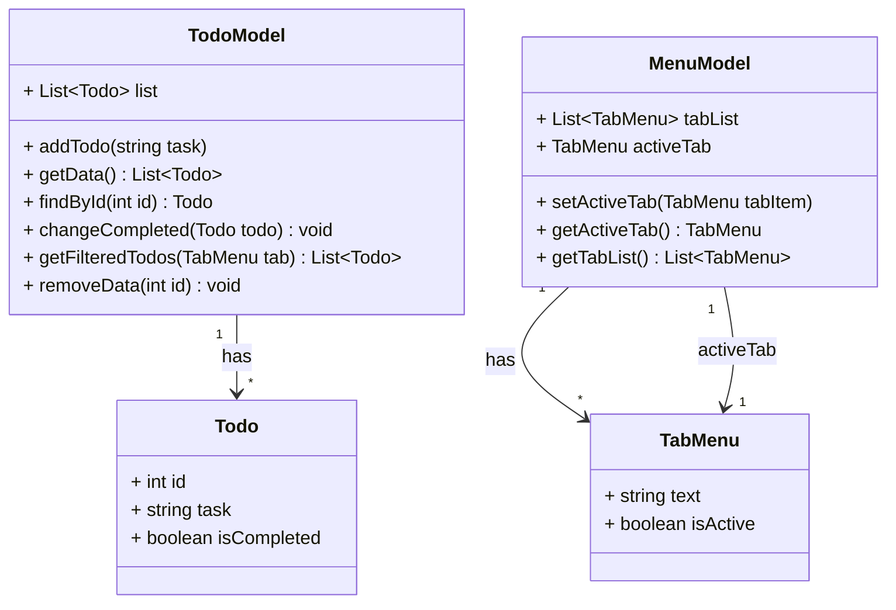

# ToDo GUI

ToDo Applications created using various GUI tools.


## Language

- Python
  - [Flet](https://github.com/webcyou-org/todo-gui/tree/main/Python/Flet)
  - [tkinter](https://github.com/webcyou-org/todo-gui/tree/main/Python/tkinter)
  - [Kivy](https://github.com/webcyou-org/todo-gui/tree/main/Python/Kivy)
  - [Remi](https://github.com/webcyou-org/todo-gui/tree/main/Python/remi)
  - [Reflex](https://github.com/webcyou-org/todo-gui/tree/main/Python/reflex/todo)
  - [PyQt](https://github.com/webcyou-org/todo-gui/tree/main/Python/pyqt)
  - [TkEasyGUI](https://github.com/webcyou-org/todo-gui/tree/main/Python/TkEasyGUI)
  - [Toga](https://github.com/webcyou-org/todo-gui/tree/main/Python/Toga)
  - [PyForms](https://github.com/webcyou-org/todo-gui/tree/main/Python/PyForms)
  - [PyGTK](https://github.com/webcyou-org/todo-gui/tree/main/Python/PyGTK)
  - [wxPython](https://github.com/webcyou-org/todo-gui/tree/main/Python/wxPython)
  - [PySide](https://github.com/webcyou-org/todo-gui/tree/main/Python/PySide)
  - Flexx
  - Azul
  - Dear PyGui
  - BeeWare
  - Eel

- C++
  - [QT](https://github.com/webcyou-org/todo-gui/tree/main/C%2B%2B/QT)
  - [wxWidgets](https://github.com/webcyou-org/todo-gui/tree/main/C%2B%2B/wxWidgets)
  - [GTK](https://github.com/webcyou-org/todo-gui/tree/main/C%2B%2B/GTK4)
  - [GTKmm](https://github.com/webcyou-org/todo-gui/tree/main/C%2B%2B/GTKmm)
  - [FLTK (Fast Light Toolkit)](https://github.com/webcyou-org/todo-gui/tree/main/C%2B%2B/FLTK)
  - [NanoGUI](https://github.com/webcyou-org/todo-gui/tree/main/C%2B%2B/NanoGUI)
  - [Dear ImGui](https://github.com/webcyou-org/todo-gui/tree/main/C%2B%2B/ImGui)
  - [raylib](https://github.com/webcyou-org/todo-gui/tree/main/C%2B%2B/raylib)
  - [bgfx + ImGui](https://github.com/webcyou-org/todo-gui/tree/main/C%2B%2B/bgfx-ImGui)
  - [Ultimate++ (U++)](https://github.com/webcyou-org/todo-gui/tree/main/C%2B%2B/U%2B%2B)
  - CEGUI (Crazy Eddie's GUI)
  - Cinder
  - Azul
  - Nuklear
  - CEF（Chromium Embedded Framework）

- JavaScript
  - [Electron](https://github.com/webcyou-org/todo-gui/tree/main/JavaScript/Electron)
  - [Tauri](https://github.com/webcyou-org/todo-gui/tree/main/JavaScript/tauri/vite/todo-gui)
  - [Neutralino.js](https://github.com/webcyou-org/todo-gui/tree/main/JavaScript/Neutralinojs/todo/)
  - [NW.js](https://github.com/webcyou-org/todo-gui/tree/main/JavaScript/NWjs/)
  - [React Native](https://github.com/webcyou-org/todo-gui/tree/main/JavaScript/ReactNative/todo)
  - [Wails](https://github.com/webcyou-org/todo-gui/tree/main/Go/Wails/todo)
  - [Lorca](https://github.com/webcyou-org/todo-gui/tree/main/Go/Lorca)
  - [Remi](https://github.com/webcyou-org/todo-gui/tree/main/Python/remi)
  - [Reflex](https://github.com/webcyou-org/todo-gui/tree/main/Python/reflex/todo)
  - [Dioxus](https://github.com/webcyou-org/todo-gui/tree/main/Rust/Dioxus/todo/)
  - [Proton Native](https://github.com/webcyou-org/todo-gui/tree/main/JavaScript/ProtonNative/todo)
  - [DeskGap](https://github.com/webcyou-org/todo-gui/tree/main/JavaScript/DeskGap/todo)
  - [Carlo](https://github.com/webcyou-org/todo-gui/tree/main/JavaScript/Carlo/todo)
  - Sciter
  - Ultralight
  - Capacitor
  - Quasar
  
- Go
  - [Fyne](https://github.com/webcyou-org/todo-gui/tree/main/Go/Fyne)
  - [Lorca](https://github.com/webcyou-org/todo-gui/tree/main/Go/Lorca)
  - [Wails](https://github.com/webcyou-org/todo-gui/tree/main/Go/Wails/todo)
  - [Gio](https://github.com/webcyou-org/todo-gui/tree/main/Go/Gio)
  - [Walk](https://github.com/webcyou-org/todo-gui/tree/main/Go/Walk)
  - [Go-GTK](https://github.com/webcyou-org/todo-gui/tree/main/Go/Go-GTK)
  - [shiny](https://github.com/webcyou-org/todo-gui/tree/main/Go/shiny)
  - [Qt for Go](https://github.com/webcyou-org/todo-gui/tree/main/Go/QtforGo)
  - go-sciter
  - nuklear

- Rust
  - [Druid](https://github.com/webcyou-org/todo-gui/tree/main/Rust/Druid/todo)
  - [Slint](https://github.com/webcyou-org/todo-gui/tree/main/Rust/Slint/todo)
  - [Tauri](https://github.com/webcyou-org/todo-gui/tree/main/JavaScript/tauri/vite/todo-gui)
  - [Iced](https://github.com/webcyou-org/todo-gui/tree/main/Rust/Iced/todo/)
  - [Dioxus](https://github.com/webcyou-org/todo-gui/tree/main/Rust/Dioxus/todo/)
  - [gtk-rs](https://github.com/webcyou-org/todo-gui/tree/main/Rust/gtk-rs/todo/)
  - [egui](https://github.com/webcyou-org/todo-gui/tree/main/Rust/egui/)
  - [fltk-rs](https://github.com/webcyou-org/todo-gui/tree/main/Rust/fltk-rs/todo/)
  - [Relm4](https://github.com/webcyou-org/todo-gui/tree/main/Rust/Relm4/todo/)
  - [vizia](https://github.com/webcyou-org/todo-gui/tree/main/Rust/vizia/todo/)
  - [rui](https://github.com/webcyou-org/todo-gui/tree/main/Rust/rui/todo/)
  - fui
  - OrbTk
  - Xilem
  - Azul
  - Makepad
  - Freya
  - Leptos
  - Ribir
  - Floem
  - KAS
  - Conrod
  - silvia
  - Masonry

- C#
  - [Avalonia](https://github.com/webcyou-org/todo-gui/tree/main/C%23/Avalonia/ToDo)
  - [Uno Platform](https://github.com/webcyou-org/todo-gui/tree/main/C%23/UnoPlatform/ToDo)
  - [WPF](https://github.com/webcyou-org/todo-gui/tree/main/C%23/WPF/)
  - [UWP](https://github.com/webcyou-org/todo-gui/tree/main/C%23/UWP/)
  - [Prism](https://github.com/webcyou-org/todo-gui/tree/main/C%23/Prism/)
  - [Xamarin.Forms](https://github.com/webcyou-org/todo-gui/tree/main/C%23/Xamarin.Forms/)
  - [WinForms](https://github.com/webcyou-org/todo-gui/tree/main/C%23/WinForms/)
  - [GTK#](https://github.com/webcyou-org/todo-gui/tree/main/C%23/GTK%23/)
  - [MAUI](https://github.com/webcyou-org/todo-gui/tree/main/C%23/MAUI/ToDo)
  - Electron.NET
  - OpenTK
  - Blazor Hybrid
  - ReactiveUI
  - Eto.Forms

- Java
  - JavaFX
  - Swing
  - Skiko

- Kotlin
  - [Compose Multiplatform](https://github.com/webcyou-org/todo-gui/tree/main/Kotlin/ComposeMultiplatform)
  - Korge
  - fritz2
  - Kvision
  - Kobweb

- Swift / macOS
  - [SwiftUI](https://github.com/webcyou-org/todo-gui/tree/main/Swift/TodoApp)
  - AppKit
  - Catalyst

- Dart
  - [Flutter](https://github.com/webcyou-org/todo-gui/tree/main/Dart/Flutter/todo)
  - Rikulo UI

- zig
  - [Dear ImGui](https://github.com/webcyou-org/todo-gui/tree/main/Zig/imgui)
  - [raylib](https://github.com/webcyou-org/todo-gui/tree/main/Zig/raylib)
  - [Qt](https://github.com/webcyou-org/todo-gui/tree/main/Zig/Qt)
  - [Nuklear](https://github.com/webcyou-org/todo-gui/tree/main/Zig/nuklear)
  - [GTK](https://github.com/webcyou-org/todo-gui/tree/main/Zig/GTK)
  - [wxWidgets](https://github.com/webcyou-org/todo-gui/tree/main/Zig/wxWidgets)
  - [zgui](https://github.com/webcyou-org/todo-gui/tree/main/Zig/zgui)
  - zig-imgui bindings
  - capy
  - dvui

## Application Specification

- Default Window Size 
  - width: 800px
  - height: 600px

## Architecture

### Class Diagram


```mermaid
classDiagram
    class Todo {
      + int id
      + string task
      + boolean isCompleted
    }
    
    class TodoModel {
      + List~Todo~ list
      + addTodo(string task)
      + getData() List~Todo~
      + findById(int id) Todo
      + changeCompleted(Todo todo) void
      + getFilteredTodos(TabMenu tab) List~Todo~
      + removeData(int id) void
    }
    
    TodoModel "1" --> "*" Todo : has
    
    class TabMenu {
      + string text
      + boolean isActive
    }
    
    class MenuModel {
      + List~TabMenu~ tabList
      + TabMenu activeTab
      + setActiveTab(TabMenu tabItem)
      + getActiveTab() TabMenu
      + getTabList() List~TabMenu~
    }
    
    MenuModel "1" --> "*" TabMenu : has
    MenuModel "1" --> "1" TabMenu : activeTab
```

### Architecture Style

It is based on the MVC pattern and adapted to the architectural style of each framework.

This may be the MVC pattern, MVP pattern, MVVM pattern, etc., but at a minimum, it should be done in the MV** format.


## Design
- Contents
  - BackGroundColor
    - #1C1C1C
  - padding
    - Top, Bottom 10px
    - Left, Right 24px
- Title
  - Color #FFFFFF
  - FontSize 18px
  - MarginBottom 14px
- ToDoInput
  - Padding 
    - Top, Bottom 4px
    - Left, Right 16px
  - TextColor #FFFFFF
  - PlaceHolderText
    - Add Task
  - PlaceHolderTextColor #9B9B9B
  - BackGroundColor #303030
  - MinWidth 430px
  - Height 35px 
  - RoundedCorners 4px
  - MarginBottom 14px
- TabMenu
  - MenuText
    - All
    - Active
    - Completed
  - TextColor #D2D2D2
  - FontSize 14px
  - lineHeight 28px
  - ActiveStyle
    - FontBold
  - MenuItemPadding
    - Left, Right 8px
  - MarginBottom 3px 
- ToDoItem
  - MinWidth 430px
  - Height 35px
  - Padding 10px
  - RoundedCorners 4px
  - BackGroundColor #2A2A2A
  - MarginBottom 5px
  - ToDoItemCheckBox
    - Width 16px
    - Height 16px
    - RoundedCorners 8px 
    - borderColor 2px #D9D9D9
    - MarginRight 18px
    - CheckedBorder 2px solid 
    - CheckedBorderColor #5DC2AF
  - FontSize 14px
  - TextColor #D2D2D2

### Style CSS

```css
/* Input Style */
input {
    border: 1px solid transparent;
}

input:focus {
    outline: none;
    border: 1px solid #5DC2AF;
}

.input.todo {
    margin-bottom: 14px;
}

.input.todo input {
    width: 100%;
    min-width: 430px;
    height: 35px;
    padding: 4px 16px;
    background: #303030;
    border-radius: 4px;
    color: #FFFFFF;
}

/* Menu List Style */
.list.menu {
    display: flex;
    list-style: none;
    margin-bottom: 3px;
}

.list.menu > li {
    height: 28px;
    padding: 0 8px;
    font-size: 14px;
    line-height: 28px;
    align-items: center;
    justify-content: center;
}

.list.menu > li.isActive {
    font-weight: bold;
}

.list.menu a {
    color: #D2D2D2;
    text-decoration: none;
}

/* Task List Style */
.list.task {
    list-style: none;
}

.list.task > li {
    display: flex;
    width: 100%;
    min-width: 430px;
    height: 35px;
    padding: 10px;
    margin-bottom: 5px;
    border-radius: 4px;
    background: #2A2A2A;
    align-items: center;
    cursor: pointer;
}

.list.task > li .checkbox {
    height: 20px;
    margin-right: 18px;
}

.list.task > li .checkbox input {
    position: relative;
    appearance: none;
    width: 16px;
    height: 16px;
    border-radius: 8px;
    border: 2px solid #D9D9D9;
}

.list.task > li .checkbox input:checked::before {
    content: "";
    position: absolute;
    left: 3px;
    top: 1px;
    display: block;
    width: 4px;
    height: 6px;
    border: 2px solid #5DC2AF;
    border-top: transparent;
    border-left: transparent;
    transform: rotate(45deg);
}

.list.task > li .text {
    font-size: 14px;
    color: #D2D2D2;
    line-height: 20px;
}

.list.task > li.isCompleted .text {
    text-decoration: line-through;
}
```

## GUI Tools official website

### Python
- [Flet](https://flet.dev/)
- [tkinter](https://docs.python.org/3/library/tkinter.html)
- [Kivy](https://kivy.org/)
- [Remi](https://github.com/dddomodossola/remi)
- [Reflex](https://reflex.dev/)
- [PyQt](https://www.riverbankcomputing.com/software/pyqt/)
- [TkEasyGUI](https://github.com/nicokimura/TkEasyGUI)
- [Toga](https://toga.readthedocs.io/)
- [PyForms](https://github.com/UmSenhorQualquer/pyforms)
- [PyGTK](http://www.pygtk.org/)
- [wxPython](https://www.wxpython.org/)
- [PySide](https://doc.qt.io/qtforpython/)
- [Flexx](https://github.com/flexxui/flexx)
- [Azul](https://azul.rs/)
- [Dear PyGui](https://dearpygui.readthedocs.io/)
- [BeeWare](https://beeware.org/)
- [Eel](https://github.com/python-eel/Eel)

### C++
- [Qt](https://www.qt.io/)
- [wxWidgets](https://www.wxwidgets.org/)
- [GTK](https://www.gtk.org/)
- [GTKmm](https://www.gtkmm.org/)
- [FLTK](https://www.fltk.org/)
- [NanoGUI](https://github.com/wjakob/nanogui)
- [Dear ImGui](https://github.com/ocornut/imgui)
- [raylib](https://www.raylib.com/)
- [bgfx](https://bkaradzic.github.io/bgfx/)
- [Ultimate++ (U++)](https://www.ultimatepp.org/)
- [CEGUI](http://cegui.org.uk/)
- [Cinder](https://libcinder.org/)
- [Azul](https://azul.rs/)
- [Nuklear](https://github.com/Immediate-Mode-UI/Nuklear)
- [CEF (Chromium Embedded Framework)](https://bitbucket.org/chromiumembedded/cef)

### JavaScript
- [Electron](https://www.electronjs.org/)
- [Tauri](https://tauri.app/)
- [Neutralino.js](https://neutralino.js.org/)
- [NW.js](https://nwjs.io/)
- [React Native](https://reactnative.dev/)
- [Wails](https://wails.io/)
- [Lorca](https://github.com/zserge/lorca)
- [Remi](https://github.com/dddomodossola/remi)
- [Reflex](https://reflex.dev/)
- [Dioxus](https://dioxuslabs.com/)
- [Proton Native](https://proton-native.js.org/)
- [DeskGap](https://deskgap.com/)
- [Carlo](https://github.com/GoogleChromeLabs/carlo)
- [Sciter](https://sciter.com/)
- [Ultralight](https://ultralig.ht/)
- [Capacitor](https://capacitorjs.com/)
- [Quasar](https://quasar.dev/)

### Go
- [Fyne](https://fyne.io/)
- [Lorca](https://github.com/zserge/lorca)
- [Wails](https://wails.io/)
- [Gio](https://gioui.org/)
- [Walk](https://github.com/lxn/walk)
- [Go-GTK](https://github.com/mattn/go-gtk)
- [shiny](https://github.com/golang/exp/tree/master/shiny)
- [Qt for Go](https://github.com/therecipe/qt)
- [go-sciter](https://github.com/sciter-sdk/go-sciter)
- [nuklear (Go)](https://github.com/golang-ui/nuklear)

### Rust
- [Druid](https://github.com/linebender/druid)
- [Slint](https://slint.dev/)
- [Tauri](https://tauri.app/)
- [Iced](https://iced.rs/)
- [Dioxus](https://dioxuslabs.com/)
- [gtk-rs](https://gtk-rs.org/)
- [egui](https://github.com/emilk/egui)
- [fltk-rs](https://github.com/fltk-rs/fltk-rs)
- [Relm4](https://relm4.org/)
- [vizia](https://github.com/vizia/vizia)
- [rui](https://github.com/audulus/rui)
- [fui](https://github.com/marek-g/rust-fui)
- [OrbTk](https://github.com/redox-os/orbtk)
- [Xilem](https://github.com/linebender/xilem)
- [Azul](https://azul.rs/)
- [Makepad](https://makepad.nl/)
- [Freya](https://freyaui.dev/)
- [Leptos](https://leptos.dev/)
- [Ribir](https://github.com/RibirX/Ribir)
- [Floem](https://github.com/lapce/floem)
- [KAS](https://github.com/kas-gui/kas)
- [Conrod](https://github.com/PistonDevelopers/conrod)
- [silvia](https://github.com/nicksack/silvia)
- [Masonry](https://github.com/linebender/masonry)

### C#
- [Avalonia](https://avaloniaui.net/)
- [Uno Platform](https://platform.uno/)
- [WPF](https://learn.microsoft.com/en-us/dotnet/desktop/wpf/)
- [UWP](https://learn.microsoft.com/en-us/windows/uwp/)
- [Prism](https://prismlibrary.com/)
- [Xamarin.Forms](https://learn.microsoft.com/en-us/xamarin/xamarin-forms/)
- [WinForms](https://learn.microsoft.com/en-us/dotnet/desktop/winforms/)
- [GTK#](https://www.mono-project.com/docs/gui/gtksharp/)
- [MAUI](https://learn.microsoft.com/en-us/dotnet/maui/)
- [Electron.NET](https://github.com/ElectronNET/Electron.NET)
- [OpenTK](https://opentk.net/)
- [Blazor Hybrid](https://learn.microsoft.com/en-us/aspnet/core/blazor/hybrid/)
- [ReactiveUI](https://reactiveui.net/)
- [Eto.Forms](https://github.com/picoe/Eto)

### Java
- [JavaFX](https://openjfx.io/)
- [Swing](https://docs.oracle.com/javase/tutorial/uiswing/)
- [Skiko](https://github.com/JetBrains/skiko)

### Kotlin
- [Compose Multiplatform](https://www.jetbrains.com/lp/compose-multiplatform/)
- [Korge](https://korge.org/)
- [fritz2](https://www.fritz2.dev/)
- [Kvision](https://kvision.io/)
- [Kobweb](https://kobweb.varabyte.com/)

### Swift / macOS
- [SwiftUI](https://developer.apple.com/xcode/swiftui/)
- [AppKit](https://developer.apple.com/documentation/appkit)
- [Catalyst](https://developer.apple.com/mac-catalyst/)

### Dart
- [Flutter](https://flutter.dev/)
- [Rikulo UI](https://rikulo.org/)

### Zig
- [Dear ImGui](https://github.com/ocornut/imgui)
- [raylib](https://www.raylib.com/)
- [Qt](https://www.qt.io/)
- [Nuklear](https://github.com/Immediate-Mode-UI/Nuklear)
- [GTK](https://www.gtk.org/)
- [wxWidgets](https://www.wxwidgets.org/)
- [zgui](https://github.com/zig-gamedev/zig-gamedev)
- [zig-imgui](https://github.com/nicksack/zig-imgui)
- [capy](https://github.com/capy-ui/capy)
- [dvui](https://github.com/david-vanderson/dvui)

## Author

**Daisuke Takayama**
* [@webcyou](https://twitter.com/webcyou)
* [@panicdragon](https://twitter.com/panicdragon)
* <https://github.com/webcyou>
* <https://github.com/webcyou-org>
* <https://github.com/panicdragon>
* <http://www.webcyou.com/>

### License

Copyright (c) 2024 Daisuke Takayama
Released under the [MIT license](http://opensource.org/licenses/mit-license.php)
