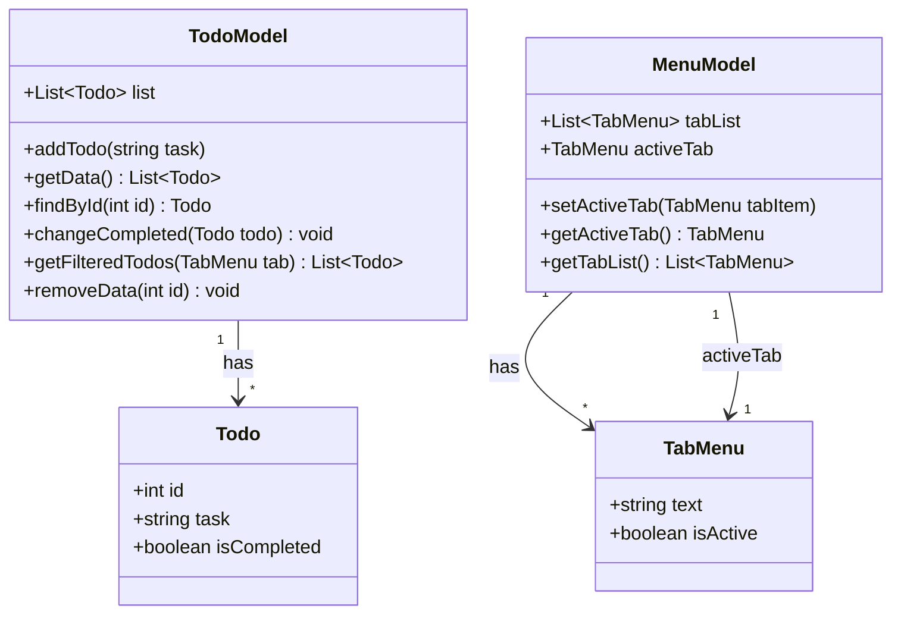

# Architecture

## Architecture Style

MV\*\* パターンをベースとし、各フレームワークのスタイルに合わせて適用する。

| パターン | 適用フレームワーク例 |
|----------|----------------------|
| MVC | VanillaJS (Electron), Go (Fyne, Gio) |
| MVP | Flutter, C# (WinForms) |
| MVVM | C# (Avalonia, WPF, Uno Platform, MAUI), Vue, React |

共通原則: **Model** にビジネスロジックを集約し、View はデータを表示するだけにする。

## Class Diagram



## Component Structure

```
App (Root)
├── Title
├── TodoInput
│   └── TextInput (placeholder: "Add Task")
├── TabMenu
│   ├── TabItem "All"
│   ├── TabItem "Active"
│   └── TabItem "Completed"
└── TodoList
    └── TodoItem[] (CheckBox + Text)
```

## Data Flow

```
User Input (Enter)
  → TodoModel.addTodo(task)
  → View re-renders TodoList

User Click (CheckBox)
  → TodoModel.changeCompleted(todo)
  → View updates TodoItem style (strikethrough)

User Click (Tab)
  → MenuModel.setActiveTab(tab)
  → TodoModel.getFilteredTodos(activeTab)
  → View re-renders TodoList with filtered data
```

## Layered Structure

```
┌────────────────────────────┐
│           View             │  UI描画・イベント受付
├────────────────────────────┤
│        Controller          │  入力→Modelへの橋渡し（MVC時）
├────────────────────────────┤
│           Model            │  状態管理・ビジネスロジック
│  ┌──────────┐ ┌──────────┐ │
│  │TodoModel │ │MenuModel │ │
│  └──────────┘ └──────────┘ │
└────────────────────────────┘
```